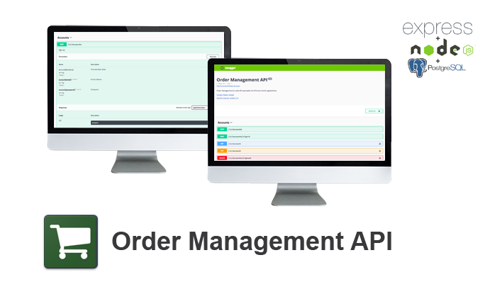

# Order Management API v1.0.0



The Order Management API is an application that provides an implementation of a back-end API for the order management.

## Requirements

* Npm / Yarn
* Node.JS
* Express.JS
* PostgreSQL
* Redis

## Installation

* Install `npm install yarn`
* Install all necessary npm packages `yarn`

## Setup

* Create a database `createdb oma`
* Create a database for testing `createdb oma_test` (Optional)
* Create a database for development `createdb oma_development` (Optional)
* Setup config file `cp ./config/env.json.sample ./config/env.json && vim ./config/env.json`
* Setup and seed database tables `yarn run seed`

## Run application - development

* `yarn run dev`

## Run application - testing

* `yarn run test`

## Libraries

 * [Node.JS](https://nodejs.org/en/) - Node.js JavaScript runtime
 * [Express.JS](http://expressjs.com/) - Fast, unopinionated, minimalist web framework
 * [Express.JS JWT](https://github.com/auth0/express-jwt) - JWT authentication middleware
 * [PostgreSQL](https://www.postgresql.org/) - Often simply Postgres, is an object-relational database management system
 * [Sequelize](http://docs.sequelizejs.com/) - Promise-based Node.js ORM for Postgres, MySQL, SQLite and Microsoft SQL Server
 * [Passport](http://passportjs.org/) - Simple, unobtrusive authentication for Node.js
 * [Redis](https://redis.io/) - Redis is in-memory data structure store
 * [BabelJS](https://babeljs.io/) - The compiler for writing next generation JavaScript
 * [Multer](https://github.com/expressjs/multer) - Middleware for handling multipart/form-data, which is primarily used for uploading files.
 * [Swagger](https://swagger.io/) - Tools for designing and building Swagger-compliant APIs entirely in Node.js
 * [Swagger UI](https://swagger.io/swagger-ui/) - Middleware for your express app to serve the Swagger UI bound to your Swagger document
 * [Chai](http://chaijs.com/) - Chai is a BDD / TDD assertion library for node
 * [Mocha](https://mochajs.org/) - Simple, flexible, fun test framework

# License - Apache License, Version 2.0

```
# (C) Copyright 2017 by Marek Hakala <hakala.marek@gmail.com>
# Licensed under the Apache License, Version 2.0 (the "License");
# you may not use this file except in compliance with the License.
# You may obtain a copy of the License at
#
# http://www.apache.org/licenses/LICENSE-2.0
#
# Unless required by applicable law or agreed to in writing, software
# distributed under the License is distributed on an "AS IS" BASIS,
# WITHOUT WARRANTIES OR CONDITIONS OF ANY KIND, either express or implied.
# See the License for the specific language governing permissions and
#    limitations under the License.
```
